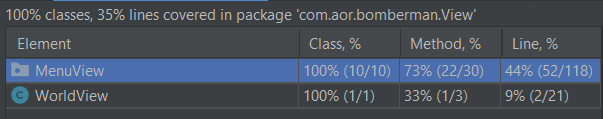

# ldts-project-assignment-g0503

- BOMBERMAN

## Game Description

Bomberman is just a simple recreation of the classic game of the same name. In our version of the game, you will spawn in a random generated map, where you can blow up barrels (which may drop a power up) and enemies. The objective of the game is to eliminate all the enemies within the time and without dying (be careful when running out of extra lives)!

This project was developed by João Pedro de Almeida Teixeira (up201900190@fe.up.pt) and Marcos William Ferreira Pinto (up201800177@fe.up.pt) for LDTS 2021-22.

## Implemented Features

- **Connected menus** - player can access different menus within one another, for example while gaming you can pause and access the controls page, after looking just go back to the game.

- **Pause Game** - A player can press “escape” to pause the game and invoke the “pause menu”, where he can continue, view controls or exit the current game.

- **Keyboard controls** - Functional buttons.
>- W to move up
>- A to move left
>- S to move down
>- D to move right 
>- Space to put a bomb while in game
>- Escape to go back to previous menu (where applicable) or pause/continue the game
>- Enter to select an option in a menu

- **Collision detection** - A player cannot go through a wall or a barrel. He also can’t go through bombs. An enemy also has the same collisions.

- **Barrels** - Barrels are the brown destructible boxes you can see on the map.

- **Bombs** - bombs can explode barrels, enemies, items and the player itself.

- **Bomb explosion** - When a bomb explodes it shows an animation of the area it affected.

- **Bomb cooldown** - When a player places a bomb, he will have to wait 2 seconds before placing another one.

- **Player walk cooldown** - To prevent a player of walking too fast (something that was happening), we implemented a feature that slows down the player to a “walkable speed”.

- **Timer** - every game has time (of 360s) that counts down to 0. If it reaches 0 and the player did not eliminate all the enemies the game is lost.

- **Barrel drops** - when a player explodes a barrel, it can drop a power up.

- **Extra life power up** - as the name suggests, it gives the player one extra life in the gameplay. When he dies, he will lose that life but respawn in the middle of the map.

- **Coins** - Barrels can drop coins and 20 of them gives an extra life.

- **Safe spawn** - to prevent player from dying right away no enemies of barrels will spawn around the area a player spawn (in the middle of the map).

- **Top menu** - a top menu is displayed during the gameplay with the time left, extra lives and coins the player have.

- **Ability to pause the game** - When a game is paused the timer stops and enemies don’t move or bomb time to explodes is subtracted.

## Screenshots

  

  <b><i>Fig 1. Main menu</i></b>

  

  <b><i>Fig 2. Game play</i></b>

  

  <b><i>Fig 3. View controls page</i></b>

  

  <b><i>Fig 4. Pause menu</i></b>

  

  <b><i>Fig 5. End menu (showing player lost the game)</i></b>

  

  <b><i>Fig 6. End menu (showing player won the game)</i></b>

## Planned features

Because of the time we had to work on the project some features were not able to be implemented, here are them:

- **Map reading** - We could store premade maps in txt files that could them be read and allows more controlled games.

- **Level progression** - If we had map reading, we could implement a level system where a player could start at level 1 and progress to harder levels.

- **Faster walking power up**

- **Smaller bomb cooldown power up**

- **One time stand block** - It would be like a bridge that could be crossed one time and them it breaks

- **Quicksand** - part of the map where player and enemies would walk slower.

- **Rolling ground** - part of the map that would automatically move player, enemies, bombs, and etc to a specific direction.

- **Different types of bombs**

- **Pushing bombs**

- **Throwing bombs**

## Design

### 1.

#### Problem in context:

The first problem of our project was which structure was needed in order to know where each class should be like and go. Overall, how to structure the game.

#### The pattern:

The principal pattern that we used was the MVC PATTERN (model-view-control pattern). 
It divides the application into three parts, each for a different purpose, allowing for a separation of functions according to their role in the game (and creating a more organized structure). This is a commonly used pattern for a GUI, which influenced our decision to use it.

#### Implementation:

  

  <b><i>Fig 7. Model-View-Controller design</i></b>

Regarding the implementation of the MVC pattern, we created three packages which main purposes are:

- Store the different components of the game, like an enemy, a coin, a bomb etc. This is the model.
- A package responsible for the drawing the needed components on the screen. This is the view.
- A package that is responsible for taking the command of a player. This is the control package.

#### Consequences:

- A better organized code that is easy to navigate and divided by its function.
- An easier way of adding features in the long run, also faster because of the organization.

### 2.

#### Problem in context:

In order to add different menus (main menu, controls menu, pause menu, end game menu, etc.) we needed to have an away of deciding which menu to show at a specific moment.

#### The pattern:

The second pattern we decided to use was the STATE PATTERN. This is a behavioral design pattern that lets an object alter its behavior depending on its state.

#### Implementation:

  

  <b><i>Fig 8. State pattern design</i></b>

In our case we needed to decide in which page the player was on to able to process it. (if the player was in the main menu it would show the main menu screen and react according to its features and etc) So, the state pattern will control in which part of the game the player is on (game screen, main menu, control menu, etc.). For example: A player will see the main menu if its view is active, but if the control menu view is active instead it will show it.

#### Consequences:
- A better organization of the different screen the player will be seeing, providing an easier way of modifying a view (screen) if needed.
- Single Responsibility Principle. The code related to each state are in separate classes.
- Open/Closed Principle. We can introduce new states without changing existing state classes. 

### 3.

#### Problem in context:

We needed a way of organizing the different component if the game (the different things that exists in the games). Since all the components have things in common, we needed a way of easily creating a new object that follows the same logic.

#### The pattern:

The pattern we used for this is the factory pattern, which provides a template of how to build a component.

#### Implementation:

  

  <b><i>Fig 9. Factory pattern design</i></b>

We create a default element class that then could be used to implement new elements without difficulty. We knew what an element needed (because we had the template) and just adapted the new element to fit its purpose.

#### Consequences:

- Single Responsibility Principle. 
- Open/Closed Principle. We can introduce new elements to our game without breaking the existing ones.
- During the gameplay we can easily add an element, for example, if a player presses to add a bomb we can just do: 
>&#8195;Bomb bomb = new Bomb(positionX, positionY);

### 4.

#### Problem in context:

In order to be able to call a method in the different states we have we needed a way to assure that all the different states had that method in the same structure.

#### The pattern:

Template method is a behavioral pattern that defines a skeleton (a common core) of the different classes, but let the classes adapt according to its needs, if it doesn’t change the structure of this core.

#### Implementation:

  

  <b><i>Fig 10. Template pattern design</i></b>

For our implementation the different states we had (they are different classes) needed to have a way of communicating its “processed Key result”, therefore we implement a skeleton that gave all the state classes the method “proccessCommand”, so that the controller could call it independent of the current state.

#### Consequences:

-	Being able to reuse code, instead of having to write it every time (although we change it, but made sure it existed in all the states)

### 5.

#### Problem in context:

Whenever something changed in the MenuStates, we had to reflect that change in the corresponding MenuView in a practical way, leaving few to none breaches to error.

#### The pattern:

The Observer pattern is a method known for reflecting changes to the objects to whom those changes might be of interest.

#### Implementation:

  

  <b><i>Fig 11. Observer pattern design</i></b>

Though the observer method often separates the “observed” class from the class that managed its observers, we had only one observer for each MenuState in this case, so the observed are directly connected to it's corresponding observer. Whenever the method that changes the state of the MenuStates (processCommand) is called, we call the updateObserver() as well, which calls the corresponding observer's update method.

#### Consequences:

- Updating the viewers is now very simple, each of them must only have an update method and it's done.

## Known code smells and refactoring Suggestions

- **Large class** - One example of a large class in our code in WorldState which essentially stores the rules and interactions of the game (because of it, it has many methods). In a way we think this is justifiable because it is what controls the game, but on the other hand we could have divided the functions of the game into separated categories and have smaller files overall.

- **Data class** - Some of our classes in the elements folder are only there because the element needs to exist. They are things like coin which only "exists", however has no behavior. This is something caused by the MVC and the organization structure we chose to our project. \
This might be a code smell however we couldn't find a way of addressing it.

- **Bloater (Long Method)** - Some of our functions can be quite long, for example proccessKey in GameModel. We could have extracted some parts of the code into separated function (but losing some organization). If we had used less ifs and a different design to store the active state this might have not being a problem.

- **Object-Orientation abuser (Switch Statement)** - When implementing some function, for example proccessKey from the code smell above, we used a lot of if's which is not the best idea. Since they just point to the right state to call the appropriate function we thought it was easier to keep them together. But like in the last code smell, having a different way of tracking the active state could have fixed the problem.

## Testing

- Inside the main test folder:

  

  <b><i>Fig 12. Tests in main folder</i></b>

- Inside /control:

  

  <b><i>Fig 13. Tests in controls folder</i></b>

- Inside /Model:

  

  <b><i>Fig 14. Tests in model folder</i></b>

- Inside /Model/Elements:

  

  <b><i>Fig 15. Tests in element folder</i></b>

- Inside /Model/MenuStates:

  

  <b><i>Fig 16. Tests in menuStates folder</i></b>

- Inside /View:

  

  <b><i>Fig 17. Tests in view folder</i></b>

- Inside /View/MenuView:

  

  <b><i>Fig 18. Tests in menuView folder</i></b>

- Pitest:

  

  <b><i>Fig 19. Pitest</i></b>

OBS: All our tests pass however for some reason Intellij is trying to test an old file (GameModelTesting) that doesn’t exist anymore and fails. We have tried fixing but couldn’t. 

## Self-evaluation

The work was divided in a way that both of us contributed according to the time available and to our best. It helped us to apply, learn and better understand java, as well as pattern styles and development knowledge. It also helped us with our teamwork skills.  
The only problem we encountered is one of our team members decided to disembark the ship, instead of riding it in search of better learning in software development.

João Teixeira: 50%  
Marcos Ferreira: 50%  
João Silva: 0%

 
 
